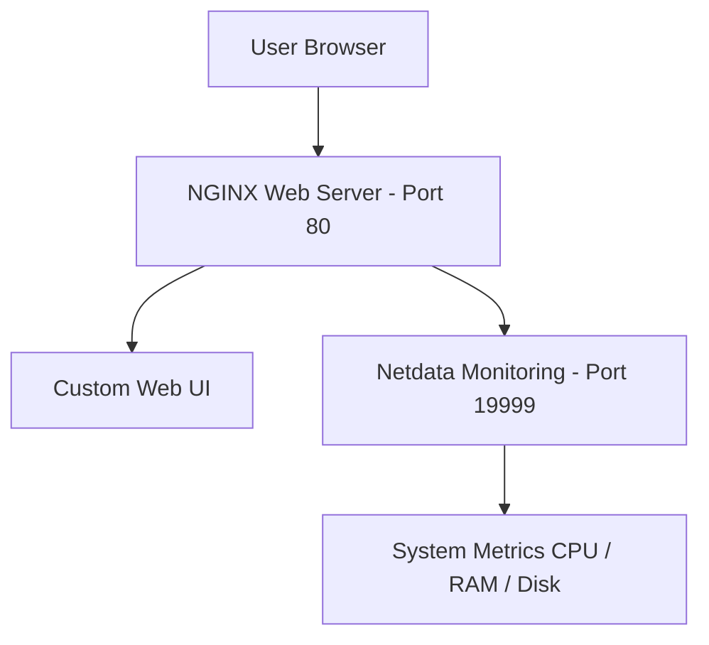

# 🚀 Ubuntu Server Deployment & Monitoring Project

## 📌 Overview
This project demonstrates a Linux server setup with:
- Web hosting using NGINX
- Custom UI deployment
- System monitoring using Netdata
- Server configuration and debugging

---

## 🧱 Architecture

---

## 🛠️ Tech Stack
- Ubuntu Server
- NGINX
- Netdata
- Linux Shell
- HTML/CSS

---

## 📸 Screenshots

### Monitoring Dashboard
.png)

### Monitoring Dashboard
.png)

### Monitoring Dashboard
.png)

### Monitoring Dashboard
.png)

### Monitoring Dashboard
.png)

---

## ⚙️ Setup Summary

1. Install NGINX
2. Create web UI
3. Install Netdata
4. Configure binding to 0.0.0.0
5. Open ports 80 & 19999
6. Debug service issues

---

## 🧠 What I Learned
- Linux server administration
- Web hosting with NGINX
- Monitoring systems
- Network ports and bindings
- Debugging service failures

---

## 👤 Author
Aishwarya
